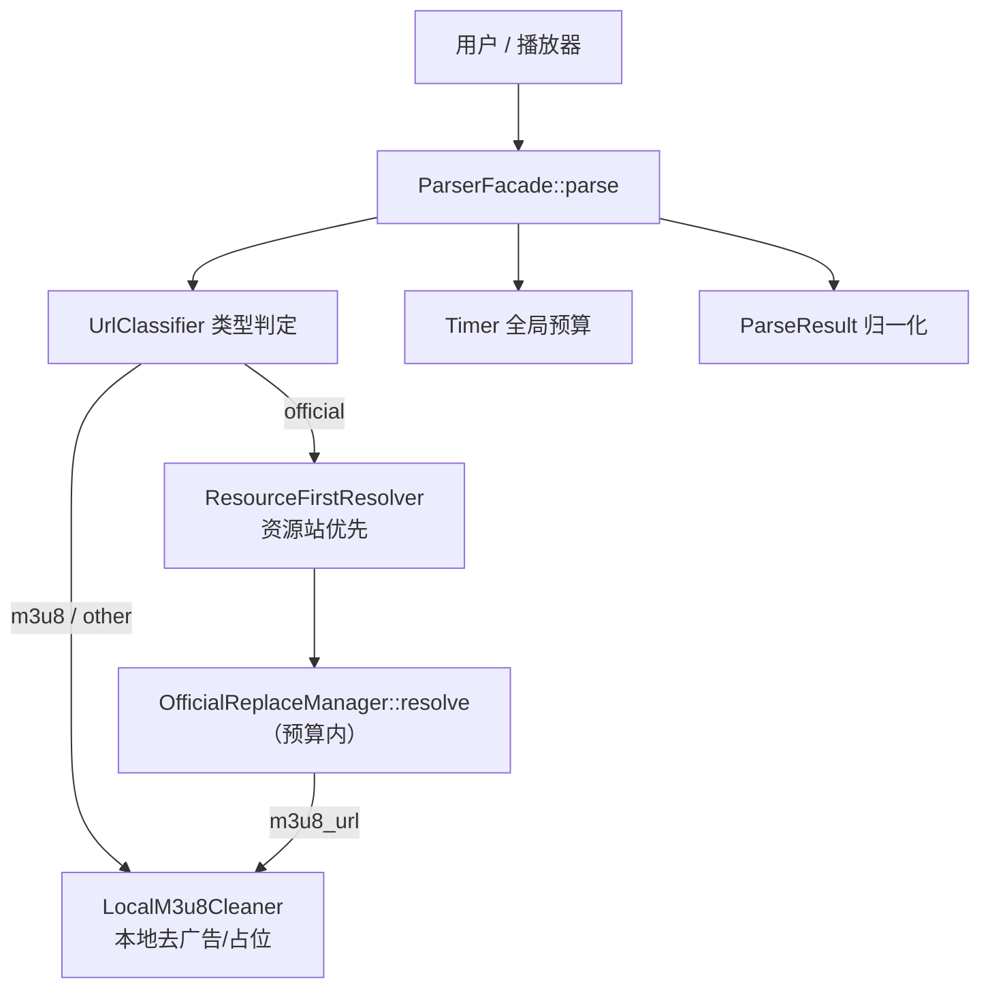

# 项目架构 / 项目导图

> 本文档梳理模块化重构后的整体架构。全新 `parse/` 模块为增量、独立、可运行骨架，
> 旧链路（mx.php / xt/server.php / gz / pt / src）保持兼容并行共存。

## 一、顶层结构

```
workspace/  (M3U8 去广告系统, main v5.13.9+)
│
├── mx.php / jiexi.php / index.php / xt.php / gx.php   入口（HTTP API 中枢）
├── mxadmin.php                                         后台管理前端
│
├── parse/                  ★ 新·模块化解析框架（本轮搭建）
│   ├── config.php            集中配置：超时预算/平台清单/去广告策略
│   ├── Timer.php             全局总预算计时器（防止卡死）
│   ├── UrlClassifier.php     URL 类型判定（m3u8 / official / other）
│   ├── ParseResult.php       归一化解析结果模型
│   ├── LocalM3u8Cleaner.php  本地去广告 / 去非正片（轻量自包含）
│   ├── ResourceFirstResolver.php  官方链接 → 资源站优先（预算内）
│   ├── ParserFacade.php      统一门面：路由 + 预算 + 归一化输出
│   ├── autoload.php          模块自动加载器
│   └── tests/
│       ├── fixtures/ad.m3u8      离线测试夹具
│       └── cli_verify.php        CLI 可运行验证脚本
│
├── src/                    基础引擎（M3U8Parser / AdFilter / M3U8AdSkipper …）
├── gz/                     高级引擎（官替 OfficialReplaceManager / 规则 / MD5占位）
├── xt/                     超级嗅探解析引擎（官解 server.php / PerformanceOptimizer）
├── pt/                     平台适配器（腾讯/爱奇艺/优酷/芒果/B站/搜狐 …）
├── db/                     数据库层（Database / 各表 Manager / autoload）
├── multi_thread/           多线程调度（CurlMulti / Process TaskRunner）
├── proxy/                  代理池管理
├── kz/ / lz/ / ai/ / cctv/  缓存、资源脚本、AI、直播源扩展
├── player/                 前端播放器页
└── docs/                   ★ 新·技术文档（本目录）
```

## 二、新解析链路（parse 门面）

```
用户 / 播放器
     │  官方URL or M3U8
     ▼
parse/ParserFacade::parse(url, cfg)
     │  ① URL 类型判定（m3u8 / official / other）
     │  ② 开启全局预算 Timer
     ├── m3u8 / other ─────────► parse/LocalM3u8Cleaner   （本地去广告/占位）
     ├── official ──────────────► parse/ResourceFirstResolver
     │        └ 预算内复用 gz/OfficialReplaceManager::resolve()  （资源站优先）
     │                 └ 得 m3u8_url ──► LocalM3u8Cleaner（去广告/去非正片）
     ▼
parse/ParseResult 归一化输出 { code,url,official_url,replace_url,title,episode,channel,step_trace,elapsed }
```

Mermaid（可在 GitHub / 支持 mermaid 的编辑器渲染）：



## 三、设计要点

| 原则 | 落地 |
|------|------|
| 小而专 | 每个类聚焦单一职责，避免再出现 200KB+ 巨型文件 |
| 绝不卡死 | 全链路 `Timer` 总预算，超限即“快速失败+明确 message+step_trace” |
| 资源站优先 | 官方链接→官替匹配 m3u8→本地去广告/占位 |
| 不中断播放 | 广告段用“等时长静音黑屏占位”，不删段 |
| 向后兼容 | 旧入口不动，`parse/` 增量共存，远程更新不回退 |

## 四、约定

- 新模块统一放 `parse/`，用 `parse/autoload.php` 加载。
- 对外统一返回 `ParseResult::toArray()` 结构。
- 网络循环务必在每次迭代调用 `$timer->ok()`。