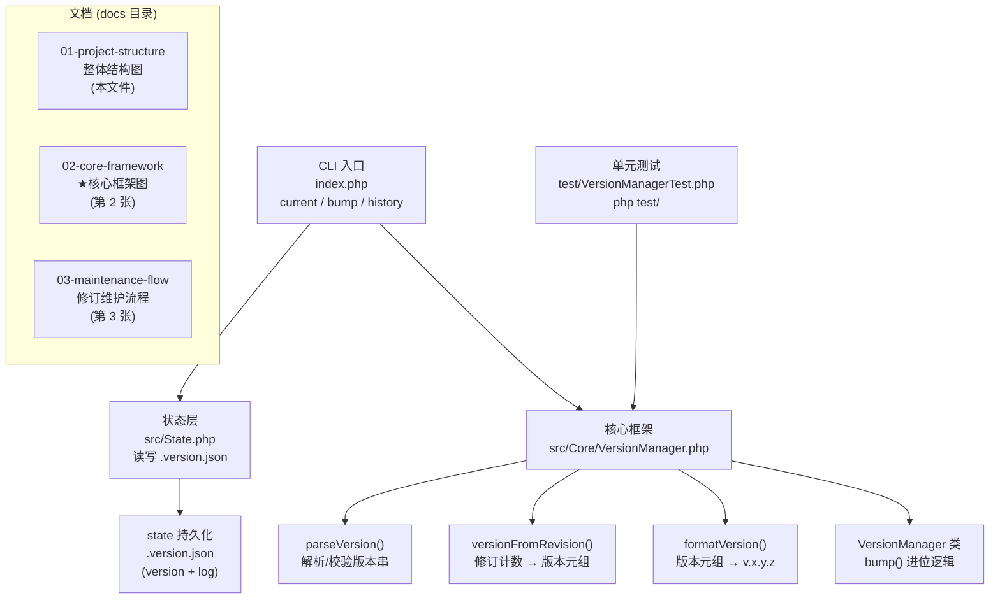

# 沫兮官替 · 源码框架结构图(第 1 张)

> 本图展示 MoxiGTI(PHP) 项目的整体模块划分与依赖关系。
> **第 2 张图为版本管理的核心框架图**，请参见 [02-core-framework.md](02-core-framework.md)。

## 图一 · 项目整体结构与模块依赖

**说明**

- 核心框架 `src/Core/VersionManager.php` 是纯逻辑、零依赖的 PHP 类，可被 CLI / 状态层 / 测试复用。
- 状态层 `src/State.php` 负责把版本与日志持久化到根目录 `.version.json`。
- CLI `index.php` 面向用户，提供 `current`、`bump`、`history` 三个命令。