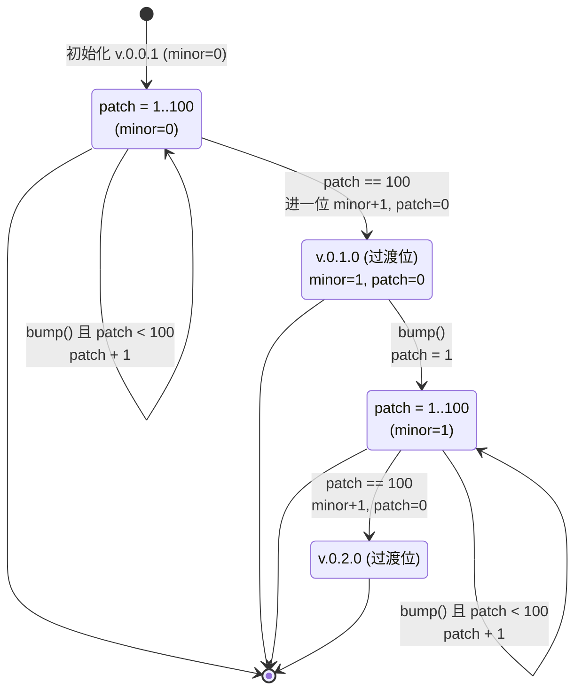
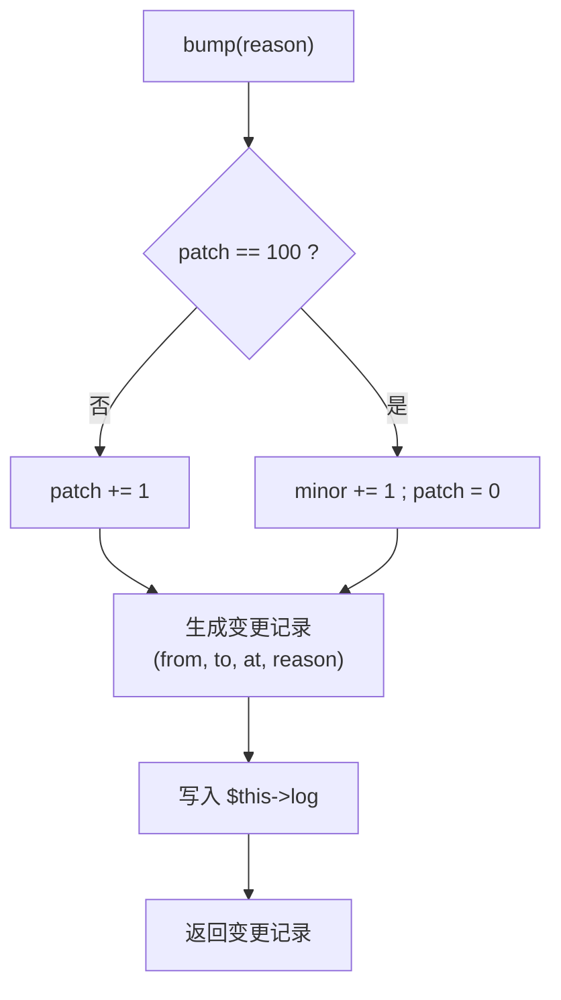

# 沫兮官替 · 核心框架图(第 2 张 · ★核心)

> 这是本项目**最核心**的一张图：完整展示**版本进位核心框架**的状态机与算法思路。

## 版本规则

> 初始版本 `v.0.0.1`；patch 每 `bump()` 一次 +1；当 patch 累计到 **100** 时进一位 minor
> 并归零：`v.0.0.100 → v.0.1.0`；之后 patch 从 `1` 重新递增，依次类推。
> 每个 minor 周期含 101 个版本（过渡位 `.0` + `.1..100`）。

## 图二 · 版本进位核心框架(状态机)

## 图 · 核心算法(bump()) 伪代码

**核心思路**

1. 用三元组 `[major, minor, patch]` 表示版本，输出格式 `v.{major}.{minor}.{patch}`。
2. `bump()` 只做一件事：patch 未满则 +1，满 100 则 minor 进位并归零。
3. 每次修订都会写入带时间戳的变更日志，便于追溯"何时改了什么版本"。
4. 由修订计数 `revision = minor × (STEP+1) + patch` 可反推版本，保证计数与版本一一对应。