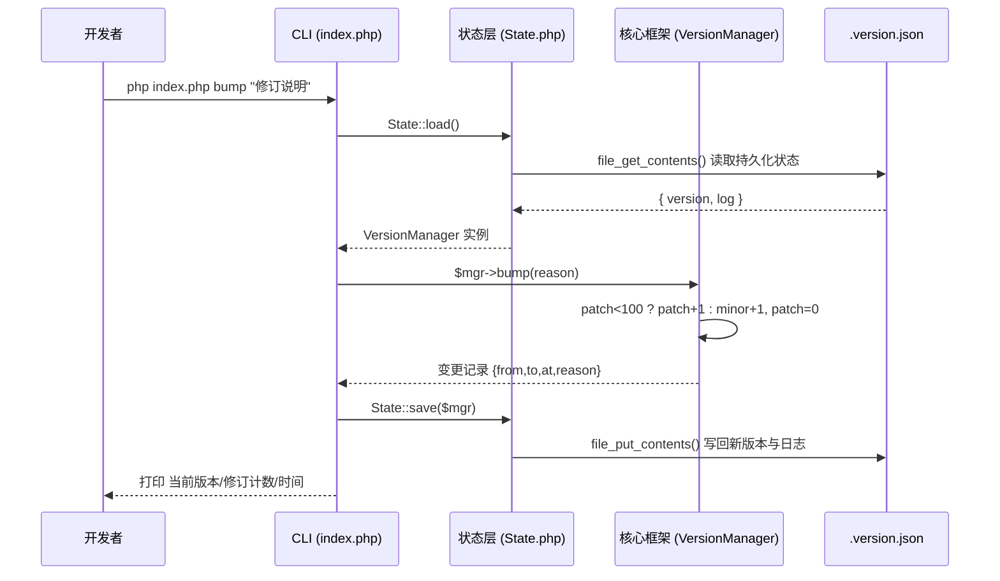

# 沫兮官替 · 修订/维护流程(第 3 张)

> 展示"每次维护或修改代码时如何递增版本"的完整流程。
> 核心版本框架见 [02-core-framework.md](02-core-framework.md)（★第 2 张）。

## 图 · 维护/修订版本流程

**运维约定**

- 每次功能新增 / Bug 修复 / 文档维护，都执行一次 `php index.php bump "说明"`。
- 可使用 `php index.php history` 随时回看版本演进历史。
- 版本达到 `v.0.0.100` 后自动进位为 `v.0.1.0`，全程无需手工干预。